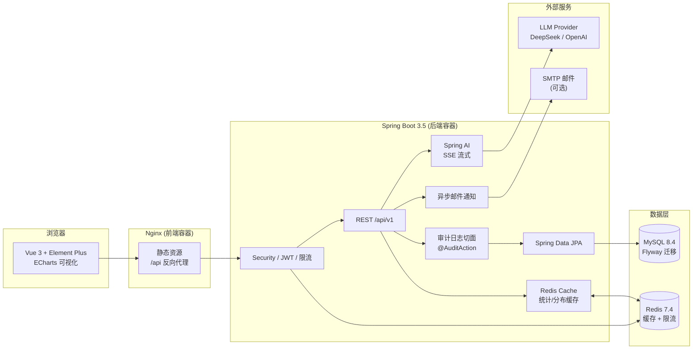
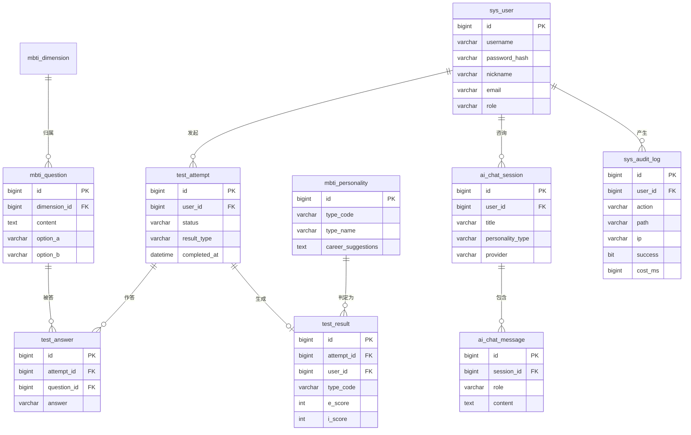

# MBTI AI Assessment Platform

一个基于现代全栈技术重构的 MBTI 职业性格测评系统。原 Servlet/JSP 项目保持不动，本目录是独立的新工程。

## 技术栈

| 层次 | 技术 |
| --- | --- |
| 前端 | Vue 3、TypeScript、Vite、Pinia、Vue Router、Element Plus、ECharts |
| 后端 | Java 17、Spring Boot 3.5、Spring AI 1.1.8（ChatClient）、Spring Security、Spring Data JPA、Bean Validation |
| 数据 | MySQL 8.4、Redis 7.4、Flyway |
| API | REST `/api/v1`、统一响应体、RFC 7807 ProblemDetail、OpenAPI |
| 测试 | JUnit 5、Mockito、MockMvc、Vitest、Vue Test Utils |
| 交付 | Docker Compose、多阶段镜像、Nginx、GitHub Actions |

## 系统架构



## 数据库设计（核心表）



## 已实现能力

- 用户注册、登录、JWT 访问令牌与刷新令牌
- 36 题测评流程、答题校验、四维计分与 16 型人格解析
- 测评历史、成长轨迹、职业建议、双人性格兼容度
- 用户 CSV 导出（UTF-8 BOM）
- 管理后台：统计、用户管理、题目 CRUD、人格类型 CRUD、分析图表
- AI 智能咨询：结合最近测评结果的多轮问答、SSE 流式输出、会话持久化与历史管理
- AI 团队分析：管理员按真实测评类型生成团队画像、沟通风险与协作建议，并保留分析历史
- AI Provider 可插拔：`mock` 离线演示、DeepSeek、OpenAI Compatible、`spring-ai`；Spring AI 通过 `ChatClient` 统一接入 OpenAI-compatible 模型，未配置密钥时自动回退 mock 且前端明确提示
- Redis 限流、统一异常、结构化日志、Actuator 健康检查
- Flyway V1/V2/V3/V4 初始化结构、种子数据、AI 持久化模型与审计日志表
- 操作审计日志：AOP 切面 + `sys_audit_log` 表，管理端分页查询与筛选
- 管理端统计缓存：Redis `CacheManager`，统计/分布接口 `@Cacheable`，测评提交自动失效
- 异步邮件通知：测评完成后 `@Async` 发送结果邮件，未配置 SMTP 自动降级为日志


## 一键启动

前置条件：Docker Desktop 已启动。

```bash
cp .env.example .env
docker compose up --build -d
```

默认地址：

- 前端：<http://localhost:5173>
- 后端 API：<http://localhost:8080>
- 健康检查：<http://localhost:8080/api/v1/health>
- Swagger UI：<http://localhost:8080/swagger-ui/index.html>
- OpenAPI JSON：<http://localhost:8080/v3/api-docs>

默认管理员：`admin / admin123`。生产环境请通过 `.env` 覆盖数据库、Redis 和 JWT 配置。

启用真实 AI 模型时，可继续使用原生 OpenAI-compatible Provider：

```env
AI_PROVIDER=deepseek
AI_API_KEY=sk-你的密钥
AI_MODEL=deepseek-chat
```

也可以启用 Spring AI `ChatClient` 适配层：

```env
AI_PROVIDER=spring-ai
AI_SPRING_MODEL_CHAT=openai
AI_API_KEY=sk-你的密钥
AI_BASE_URL=https://api.deepseek.com
AI_MODEL=deepseek-chat
AI_TEMPERATURE=0.7
```

未配置密钥时系统保留完整的 mock 全链路，便于离线演示和测试；它不会被描述成真实模型输出。

停止服务：

```bash
docker compose down
```

清空本地数据卷并重新迁移：

```bash
docker compose down -v
docker compose up --build -d
```

## 本地开发

```bash
cd backend && mvn spring-boot:run
cd frontend && npm install && npm run dev
```

前端开发服务器默认代理 `/api` 到 `http://localhost:8080`。

## 测试与真实端到端验证

```bash
cd backend && mvn clean verify
cd frontend && npm ci && npm run type-check && npm test -- --run && npm run build
```

容器启动完成且健康后，可用 PowerShell 7 执行真实 API 闭环验证：

```powershell
pwsh -NoProfile -File ./scripts/e2e-verify.ps1
```

脚本覆盖注册、登录、刷新、双用户 36 题测评、结果、成长、职业建议、兼容度、CSV BOM、管理员统计与 CRUD，以及 AI 状态、同步/流式咨询、会话续聊、团队分析、历史记录和 403 权限边界。脚本会在当前容器环境中输出实际断言总数，不写死数字。

## 数据库迁移

迁移文件位于 `backend/src/main/resources/db/migration/`：

- `V1__init_schema.sql`：完整表结构与索引
- `V2__seed_data.sql`：管理员、8 个维度、36 道题、16 种人格类型
- `V3__ai_capability.sql`：AI 会话、消息与团队分析记录表

Flyway 在后端启动时自动执行迁移，无需手工建表。

## 项目结构

```text
backend/   Spring Boot API 与 Flyway 迁移
frontend/  Vue 3 管理端与用户端
docs/      架构、部署、安全、测试、性能与 CI/CD 文档
scripts/   真实端到端验证脚本
```

更详细说明见 [docs/deployment.md](docs/deployment.md)、[docs/security.md](docs/security.md)、[docs/testing.md](docs/testing.md) 和 [docs/phase-4-5-plan.md](docs/phase-4-5-plan.md)。
